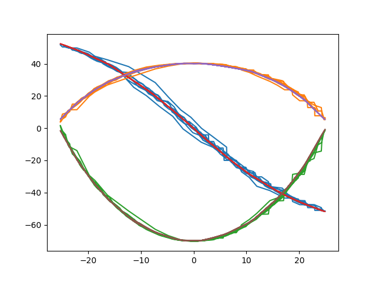

# hexapod robot python code

## 一定要测电池用的时间

see [notice](./NOTICE.md)

0.54
## t

使用角速度不行，要用速度才好点

## 文件结构

### 有用的文件

#### python

[hexapod.py](./hexapod.py) - vrep机器人仿真控制类

[by_opt.py](.by_opt.py) - 贝叶斯优化程序

[control.py](./control.py) - 主控制程序,跑真赛道的时候用

[bluetooth_control.py](./bluetooth_control.py) - 蓝牙信息发送类

[image_train.py](./image_train.py) 包括:

1. 循迹神经网络训练程序

    ```python
    train = ImageTrain()
    train.train(data=data,label=label) # data为数据 label为标签
    ```

2. vrep仿真,使用`test_robot()`这行代码来在vrep中仿真.(不要改`'turn_straight_cla_v0.2.h5'`这个)

[image_label.py](./image_label.py) - 用于标记图片

#### arduino

None

### 没用的文件(夹)

tet.py
./deprecated/
./map/
./logs/

## 训练过程

1. 使用[sample-data.py](./sample-data.py)采集数据-数据为`.npy`格式
2. 更改[regresion.py](./regression.py)中将`if __name__ == "__main__":`内的程序更改如下

    ```python
    label = np.load('./data/label_ahead.npy')
    data = np.load('./data/data_ahead.npy')
    model=model_2()
    label = label.reshape(label.shape[0], 1)
    history = model.fit(
        label, data, epochs=150, batch_size=8, validation_split=0.05)
    model.save('./data/NN_ahead.h5')
    graph('ahead')

    label = np.load('./data/label_middle.npy')
    data = np.load('./data/data_middle.npy')
    model=model_2()
    label = label.reshape(label.shape[0], 1)
    history = model.fit(
        label, data, epochs=100, batch_size=8, validation_split=0.1)
    model.save('./data/NN_middle.h5')
    graph('middle')

    label = np.load('./data/label_back.npy')
    data = np.load('./data/data_back.npy')
    model=model_2()
    label = label.reshape(label.shape[0], 1)
    history = model.fit(
        label, data, epochs=150, batch_size=8, validation_split=0.05)
    model.save('./data/NN_back.h5')
    graph('back')

    #检查训练的模型准确率
    graph('back')
    graph('middle')
    graph('ahead')
    ```

3. 检查弹出的图片中图形的拟合情况,例如
    

>因为仿真使用的数据是`.npy`文件,所以这时候仿真所用的数据就是新生成的数据了

4. 更改[regresion.py](./regression.py)中将`if __name__ == "__main__":`内的程序更改为`generate_use_data_t([[范围1],[范围2],[范围3]],采样率)`,然后程序会在`hexapod`文件夹内生成`arduino.txt`

>这个`范围1`是一个列表`[下限,上限]`,例如`[-15,15]`
>
>这个范围就是上图中`x轴`的范围,也就是`vrep`中`tip`的坐标
>
>采样率是生成数组的长度,一般填`30`就可以了

5. 将[arduino.txt](./arduino.txt)中的数据复制到`control.ino`就可以了

>生成的`arduino.txt`共有六行分别对应
>
>```c++
>//data begin
>const PROGMEM uint16_t  straight_ahead_right[30][3] = 
>const PROGMEM uint16_t straight_middle_right[30][3] = 
>const PROGMEM uint16_t   straight_back_right[30][3] = 
>const PROGMEM uint16_t   straight_ahead_left[30][3] = 
>const PROGMEM uint16_t  straight_middle_left[30][3] = 
>const PROGMEM uint16_t    straight_back_left[30][3] = 
>```
>
>这六行,将他们分别复制到这六行的后面就可以了,注意格式`arduino.txt`中每行数组末尾格式是不对的,记得改

___

## 下面的似乎没什么用了

___

## 运行 image-capture 采集数据

### 更改转弯角度

在`image-capture.py`文件中更改下面的东西

``` python
while True:
    if STATE==0:
        rb.one_step(0.003)
    if STATE==1:
        rb.turn_left([20, 30])
    if STATE==2:
        rb.turn_right([20,36])
```

## 摄像头参数

1. 角度 60度
2. 分辨率 1920*1080

## 怎样转向

两种方法

1. 直接分类四种转向状态
2. 间接获取数据计算转向状态(四种状态,两种状态?)

### 获取什么间接数据

1. 轨迹线的中线
2. 轨迹线的边线

## 训练结果很受杂音的影响,模型抓不到重点

## cv2 notice

cv2 图片似乎支持两种格式

1. `np.int8`:用于图片显示
2. `np.float`:用于图片处理
3. `np.uint8`:用于数据保存,图片显示,读取

两者可以通过`np.astype`转换

*注意: np.int8范围是 -128 - 128 如果搞错可能会出现画面变白*

## 其他

1. 训练集数组为`np.uint8`

## 解决使用cv2是pylint的报错  `Module 'cv2' has no **** member`

1. 使用`from cv2 import cv2`
2. 更改pylint设置`pylint --extension-pkg-whitelist=cv2`

## 赛道制作

1. pv纸 80cm 宽:制作大弯
2. 0.6 * 0.9 似乎最便宜
